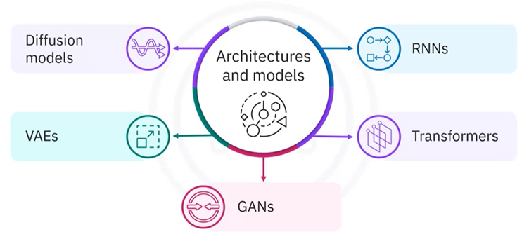
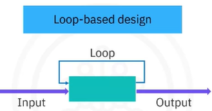
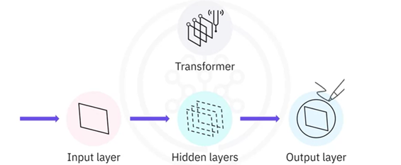
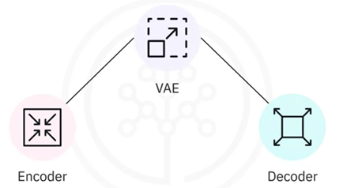
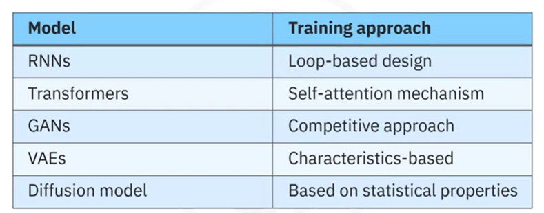

# Generative AI Architecture and Models

## RNN(Re-current Neural Networks)

RNNs are artificial neural networks that use sequential or time series data. You use them to solve data related problems with a natural order or timebased dependencies.
RNNs differ from regular neural networks due to loops built into their structure. This loop-based design enables RNNs to remember previous inputs and influence the current input and output. This design is crucial for tasks that deal with sequences such as language modeling.

You should fine-tune generative AI architectures and models to make them generate more accurate and contextually relevant content. Fine-tuning is adjusting a pretrained model to improve performance for a specific task or data set. 
In RNN fine-tuning, adjustments to the weights and structure of the recurrent neural network might be necessary to align it with specific tasks or datasets. 

You can use RNNs in 
- natural language processing or NLP language translation,
- speech recognition
- image captioning.

## Transformers

- Transformers are deep learning models that can translate text and speech in near real time. They take data such as words or numbers, and pass it through different layers. 
- Information flows in one direction, starting at the input layer, going through hidden layers, and reaching the output layer. 
- The transformer employs feedback mechanisms to improve accuracy. 
- Transformers are designed with a self attention mechanism that enables the model to focus on the most important parts of the information it's looking at, making its understanding and decision-making more efficient. 
- The selective focus on different parts of the input sequence allows the model to concentrate on specific segments concurrently, enabling parallelization for efficient training. 

In transformer fine-tuning, the pretrained transformer model remains largely intact, and fine-tuning typically involves training only the final output layers for the specific task. The transformer's self attention mechanisms and other layers usually remain fixed. 

A generative pretrained transformer or GPT is an example of a generative model that demonstrates exceptional text generation capabilities within the transformer architecture. GPT is a generative model trained to predict and generate text sequences based on the patterns learned from its training data. 

Even though it doesn't explicitly model the underlying data distribution Like some generative models, its capacity to produce text that mirrors its training data distribution and its versatility in fine-tuning confirms its role as a generative model.

## GAN (Generative Adversarial Networks)

- GAN is a generative AI model consisting of two submodels, a generator and a discriminator. 
- The generator creates fake samples and sends them to the discriminator. 
- The discriminator checks their authenticity by comparing them with real samples from a domain set. It then assigns a probability score to each sample, indicating how likely the sample is to be authentic. 
- This adversarial process continues like a friendly competition, with the generator striving to make things look real and the discriminator learning to distinguish between real and fake, both entities improving their respective outputs. 
- You'll find GAN specifically useful for image and video generation.

## VAE

- VAE, operates on an encoder decoder framework. 
- The encoder network first compresses input data into a simplified abstract space that captures essential characteristics. 
- The decoder network then uses this condensed information to recreate the original data.
- VAEs focus on learning the underlying patterns within the input data, making it possible to create new data samples that share similar characteristics. 
- VAEs represent data using probability distributions in the latent space. 
- They can produce a range of possible outputs for a given input, reflecting the inherent uncertainty in real world data. 
- You'll find them useful in applications related to art and creative design

## Diffusion Models

- Diffusion model, a probabilistic generative model. 
- A diffusion model is trained to generate images by learning how to remove noise or reconstruct examples from its training data that have been distorted beyond recognition. 
- Depending on the prompt, a diffusion model can generate highly creative images based on the statistical properties of its training data. 
- You can use a diffusion model to generate high quality images from noisy or low quality inputs, like restoring an old, distorted photograph

## Summary of the models

Generative AI models are closely tied to reinforcement learning. 
Traditional reinforcement learning focuses on how agents like AI systems or robots interact with their environment to maximize rewards. Generative AI models employ reinforcement learning techniques during training to fine tune and optimize their performance for specific tasks
