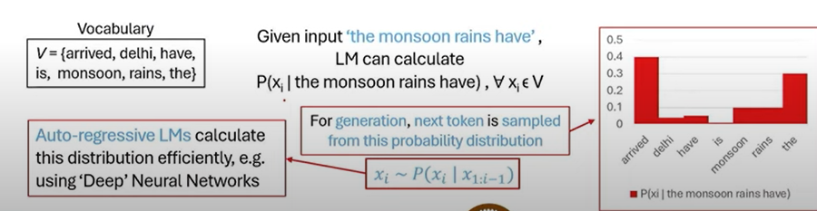

# Week 1  

## Lecture 1 : Introduction and Recent advances

**What is Language Model(LM)?**

Language Models gives the probability distribution over a sequence of tokens.

The language model must be able to give the probability of a particular sequence of tokens. The sequence of token may or may not make complete sense.

Language model also understand sementaically correct. In other words LM also understand the world's knowledge.

Corpus is the document that is provided to study. The unique tokens are called types. Each token is word.

All unique tokens in the corpus forms the Vocabulary.

This becomes a generation problem where in if we are given x1 and x2, what is probablity of getting x3.

This model is also called auto regressive model since given a token it will generate the next token in sequential manner.

**Large Language model**

In this context Large in  terms of model's size (no. of parameters) and massive size of training dataset.

## Evolution of LLMs

- BERT focussed on the encoder part of the transformer architecture.
- GPT focussed on the decoder part of the transformer architecture.
- GPT1 117m paramter -> GPT2 (1.5 B) 13x increase in no. of parameters, but minimal changes in the architecture. However the the context length increase GPT 1 (512 tokens) -> GPT 2 (1024 tokens)

- **T5** by google - encoder decoder task, they unified a text to text task. The pre traing strategy is similar to BERT.

- **RoBERTa** : Robustly Optimized BERT Pretraining Approach
In the model, they showed that the BERT model is significantly undertrained. With more training we can match or exceed the performance of every model publised after it.

- **XLM** : Cross lingual Language Model Pretraining.

- In **GPT3** paper ( Language Models are Few shot Learners) we saw for the first time the term Large Language models.
- It had 175 B parameters.
- Incontext Learning : During inference time some examples are given, for a downstream task, and without any gradient update with the neural network, the model should be able to understand the examples and perform significantly well.
- This is an emerging property from scaling law : As you keep increasing the size of model, the model should be able to preform better.

**Palm** : 540 B parameters. 

**OPT**: Open Pre trained Transformer Language Models. It is a suite of decoder only pre-trained transformer raning from 125M to 175B parameters.

 
 
 
 

**More details of why this course?**

